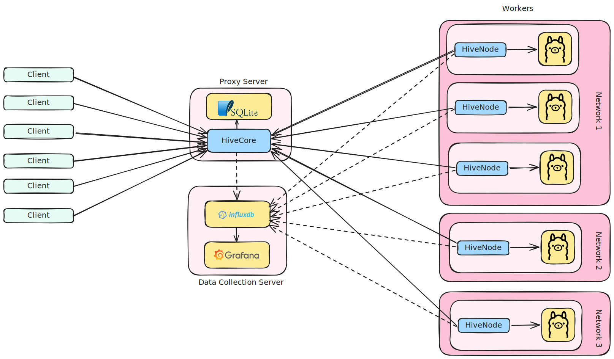

<div align="center">
  
    
</div>


# HiveNode

HiveNode is the worker component of the Hive system. It connects to a central [HiveCore](https://github.com/VakeDomen/HiveCore) proxy and runs local inference using [Ollama](https://ollama.com/). By running HiveNode on any machine (on-premise, cloud, or behind firewalls), you can join that machine’s compute resources to the HiveCore network and serve requests routed by the central proxy.

# Table of Contents

1.  [**Overview**](#1-overview)
2.  [**Key Features**](#2-key-features)
3.  [**Installation & Setup**](#3-installation--setup)
4.  [**Configuration**](#4-configuration)
5.  [**Running**](#5-running)
6.  [**How it Works**](#6-how-it-works)
7.  [**Logging & Monitoring**](#7-logging--monitoring)
8.  [**Contributing**](#8-contributing)
9.  [**License**](#9-license)

# 1. Overview

In the Hive architecture:

- **HiveCore** serves as the central proxy and gateway, managing queues and distributing inference requests.
- **HiveNode** runs on worker machines. It connects out to HiveCore (so the worker does not need to be publicly accessible). Once connected, HiveNode polls inference jobs from HiveCore, which then uses its local Ollama server to process requests.

This design allows multiple machines, possibly spread across different networks, to operate as a single, unified inference cluster.

# 2. Key Features

- **Docker-First Ollama Runtime**

    HiveNode primarily manages an `ollama/ollama` Docker container itself, including startup and in-place upgrades.
- **Bring Your Own Ollama**

    If you already run Ollama yourself, HiveNode can target an external Ollama URL instead of managing Docker.
- **Multiple Concurrent Connections**

    Each HiveNode can open several parallel connections to HiveCore, letting you scale inference throughput per worker.
- **Centralized Configuration & Scaling**

    Workers require minimal configuration—just point them to HiveCore and set a valid key. 
- **Extensible Logging**

    Built-in InfluxDB logging for GPU usage (via NVML) and system metrics if environment variables are set.

# 3. Installation & Setup

1. **Prerequisites**
    - [Rust](https://www.rust-lang.org/tools/install) toolchain (for building HiveNode)
    - Either Docker access for the default managed mode, or an existing reachable Ollama instance for external mode.
    - valid `Worker` key generated by [`HiveCore`](https://github.com/VakeDomen/HiveCore). (See HiveCore’s management endpoints for instructions.)

2. **Clone the repository**
    ```bash
    git clone https://github.com/VakeDomen/HiveNode.git
    cd HiveNode
    ```
3. **Configure**
    - rename `.env.sample` to `.env`
    ```bash
    mv .env.sample .env
    ```
    - configure the `.env` environment as defined in [Configuration](#4-configuration)
4. **Run**
    - see [Running](#5-running)
    ```bash
    cargo run --release
    ```

# 4. Configuration
A sample `.env` for the default Docker-managed mode might look like:
```ini
# The address and port of HiveCore’s node connection server (default 7777 in HiveCore).
HIVE_CORE_URL=hivecore.example.com:7777

# Worker key provided by HiveCore admin. Must have "Worker" role.
HIVE_KEY=my-secret-key

# docker (default) or external
OLLAMA_MODE=docker

# Docker-managed Ollama settings
OLLAMA_PORT=11434
HIVE_OLLAMA_MODELS=/usr/share/ollama/.ollama/
GPU_PASSTHROUGH=-1

# Number of parallel connections to open to HiveCore. Best to match Ollama configuration.
CONCURRENT_REQUESTS=4

# (Optional) InfluxDB settings for logging
INFLUX_HOST=http://localhost:8086
INFLUX_ORG=MY_ORG
INFLUX_TOKEN=my-token
```

A sample `.env` for bring-your-own Ollama mode:
```ini
HIVE_CORE_URL=hivecore.example.com:7777
HIVE_KEY=my-secret-key
OLLAMA_MODE=external
OLLAMA_URL=http://localhost:11434
CONCURRENT_REQUESTS=4
```

A sample `.env` for an external vLLM server:
```ini
HIVE_CORE_URL=hivecore.example.com:7777
HIVE_KEY=my-secret-key
INFERENCE_BACKEND=vllm
VLLM_URL=http://localhost:8000
CONCURRENT_REQUESTS=4

# Optional, if vLLM was started with an API key.
VLLM_API_KEY=token-abc123
```

- `HIVE_CORE_URL`: Where HiveNode connects to HiveCore (must match HiveCore’s `NODE_CONNECTION_PORT`, by default `7777`).
- `HIVE_KEY`: The Worker key from HiveCore’s admin interface. Required for authentication.
- `INFERENCE_BACKEND`: Optional. Defaults to `ollama`. Set to `vllm` to advertise and proxy an external vLLM server.
- `OLLAMA_MODE`: `docker` by default. Set `external` to use an existing Ollama instance instead of Docker-managed Ollama.
- `OLLAMA_PORT`: Host port for the Docker-managed Ollama container. Required in `docker` mode.
- `HIVE_OLLAMA_MODELS`: Host directory mounted into the Docker-managed Ollama container for model storage. Required in `docker` mode.
- `GPU_PASSTHROUGH`: Optional GPU selection for Docker mode. Use `-1` for all GPUs, a comma-separated list such as `0,1` for specific GPUs, or leave unset for CPU mode.
- `OLLAMA_URL`: Required only in `external` mode. The local or remote address of the Ollama service.
- `BACKEND_URL`: Optional backend URL override. For vLLM this should be the server origin, such as `http://localhost:8000`; HiveCore should send `/v1/...` request paths.
- `VLLM_URL`: Required for vLLM if `BACKEND_URL` is not set. This should be the server origin, such as `http://localhost:8000`.
- `BACKEND_API_KEY` / `VLLM_API_KEY`: Optional bearer token added to vLLM requests when the incoming request does not already include `Authorization`.
- `CONCURRENT_REQUESTS`: Sets how many parallel connections (and thus concurrent tasks) this HiveNode should proxy. Adjust based on your hardware resources and [Ollama configuration](https://github.com/ollama/ollama/blob/main/docs/faq.md).
- `INFLUX_*`: (Optional) If configured, HiveNode will record logs and GPU usage metrics to InfluxDB. If not provided, it simply won’t log to Influx.

## Ollama setup
Docker-managed mode is the primary path. In this mode HiveNode will pull or reuse `ollama/ollama`, bind it to `OLLAMA_PORT`, mount `HIVE_OLLAMA_MODELS`, and internally set `OLLAMA_URL` to that local container.

If you prefer to manage Ollama yourself, set `OLLAMA_MODE=external` and provide `OLLAMA_URL`.

For vLLM, run the vLLM OpenAI-compatible server separately and set `INFERENCE_BACKEND=vllm` with `VLLM_URL` or `BACKEND_URL`. HiveNode discovers models through `GET /v1/models`, advertises them with `POLL-VLLM`, and proxies HiveCore's `/v1/...` requests to the configured vLLM server.

If you want to prepare an Ollama host manually, or experiment with multiple instances and GPU layouts, you can use the provided `setup_ollama.sh` helper script.

This script:
    - Checks if netstat and curl are installed (and installs them if not).
    - Installs Ollama if not already present.
    - Lets you pick how many Ollama instances to run and how to assign GPUs to each instance.
    - Finds free ports for each Ollama instance, runs it, and logs their output.

```bash
chmod +x setup_ollama.sh
./setup_ollama.sh
```

# 5. Running
After configuring the `.env` file, run:
```bash
cargo run --release
```

Or compile and execute binary directly:
```bash
cargo build --release
./target/release/hive_node
```

# 6. How it Works
1. **Authentication**
    - On startup, HiveNode initializes the selected inference backend.
    - Each of the `CONCURRENT_REQUESTS` worker threads tries to authenticate to HiveCore using the key in `HIVE_KEY`.
    - Upon successful auth, HiveNode advertises its versions and its supported models to HiveCore. 
2. **Polling & Proxying**
    - HiveNode periodically polls HiveCore for incoming tasks. If HiveCore’s queue has work for a given model, it dispatches it to the node.
    - HiveNode forwards the request to the configured backend URL for local inference, then streams the response back to HiveCore.
    - New Ollama workers send `POLL-OLLAMA`; vLLM workers send `POLL-VLLM`. Legacy workers may still send plain `POLL`.
3. **Reconnection & Control**
    - If the connection drops or an error occurs, HiveNode waits briefly, then reconnects.
    - HiveCore can issue commands like `REBOOT` or `SHUTDOWN`, which HiveNode listens for in the incoming messages.
    - `UPDATE` is supported in Docker-managed mode and causes HiveNode to refresh the Docker image and reconnect.
4. **Scaling**
    - To allow more capacity on the same machine, increase the `CONCURRENT_REQUESTS` count.
    - To add more workers across multiple machines, simply run additional HiveNode instances (each with its own .env and valid Worker key).
    - Hive supports having multiple workers on the same machine, but each worker should have its own token.


<div align="center">
  
    
</div>

# 7. Logging & Monitoring
HiveNode can log system metrics like GPU usage, memory, and proxied requests to InfluxDB:
- **Enable Influx Logging**: Provide `INFLUX_HOST`, `INFLUX_ORG`, and `INFLUX_TOKEN` in the `.env`.
- **GPU Metrics:** HiveNode uses [NVML](https://docs.rs/nvml-wrapper/latest/nvml_wrapper/) to gather GPU info. This is only collected if an NVIDIA GPU is present and NVML is available on the system.
- **Request Streaming:** All inference requests and responses can be logged with success/error tags.

These metrics are pushed to Influx in the background. If any of the Influx environment variables are missing or invalid, HiveNode just skips that monitoring.

# 8. Contributing
We welcome pull requests! Before submitting, please open an issue to discuss your proposed changes. Make sure to:
- Keep code style consistent.
- Update documentation if adding or changing features.


# 9. License
HiveNode is distributed under the MIT License, just like HiveCore. See the LICENSE file in this repository for details.
